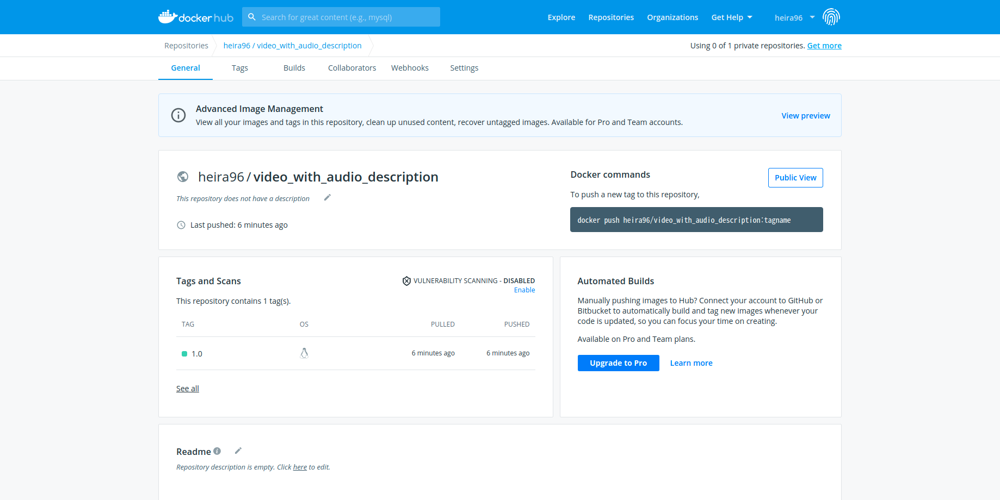

# BIG DATA Project_A1
### 5/10~6/4
for BIG DATA Project communication and collaboration
- 2021/05/27 gitkraken을 이용한 관리

# AI Project_A1
### 6/7~7/6

## 프로젝트 flow 및 실행방법

 

1. 도커 이미지 pull - 링크 붙이기
2. 도커 실행 - 명령어써주기
3. clone 할거 해주기
4. 각각 수행하기
- tacotron2 [link](https://github.com/raneelulu/tacotron2)
- waveglow [link](https://github.com/raneelulu/waveglow)
- VAD [link](https://github.com/raneelulu/VAD)
- Video captioning [link](https://github.com/yunsujeon/BMT)  

## docker image [link](https://hub.docker.com/repository/docker/heira96/video_with_audio_description)
   

``` docker push heira96/video_with_audio_description:1.0 ```
## 일지 6/16

### **video captioning**

1. 전기수(8기) 연구인턴 참고. [github link](https://github.com/Hinterhalter/CCTV_Video_Captioning)
2. 그 중 [grounded-video-description](https://github.com/facebookresearch/grounded-video-description) 참고 
3. clone 후 conda create 해줌
   - conda env create -f cfgs/conda_env_gvd_py3.yml
   - 실행 시 gvd_py3_pytorch1.1 의 conda 생성됨 (pytorch1.1)
4. clone 한 repo에는 누락된 사항이 있음
   - tools/densevid_eval 채워주기 [링크](https://github.com/LuoweiZhou/densevid_eval_spice)
   - tools/densevid_eval/coco-caption 채워주기 [링크](https://github.com/LuoweiZhou/coco-caption/tree/de6f385503ac9a4305a1dcdc39c02312f9fa13fc)
5. pretrained models 다운로드 및 save 폴더에 저장 (Pre-trained Models 탭) 
   - https://dl.fbaipublicfiles.com/ActivityNet-Entities/ActivityNet-Entities/pre-trained-models.tar.gz
6. 전기수가 2.27 언급한 사항 중 main.py에 eval함수가 사용되지 않은 오류
   - 전기수github[링크](https://github.com/Hinterhalter/CCTV_Video_Captioning) -> flicker/main.py 다운로드 후 대체
7. eval_grd_flickr30k_entities.py가 없다는 오류로  etools/anet_entities 경로에 다운받아줌. [링크](https://github.com/facebookresearch/grounded-video-description/tree/flickr_branch)
   - 본 깃헙에 flicker_branch 를 ctrl+F 하면 찾을 수 있음

현재 오류
- Exception: only support flickr30k!

남은 문제들
- 직접 train 하기에는 data 크기가 216GB로 용량부족하고 , computing power 도 부족함 
- 우선 inference model 돌려보고 오류사항 계속 체크할 것

## 6/17

### **video captioning**

1. 데이터가 두 분류 나뉘는 것을 확인
   - ActivityNet-Entities / flickr30k
2. 원본 레포지토리는 anet 을 이용. flickr 를 이용한 branch를 clone 해봄
   - git clone -b flickr_branch --recursive https://github.com/facebookresearch/grounded-video-description
3. flickr는 image data로 training, anet 은 영상 포함 -> 전기수는 flickr로 함
4. flickr의 Pre-trained Models를 받아서 save 밑에 위치시킴
5. Inference 시 없는 파일이 계속해서 존재
   - Data Preparation 에서 찾아서 다운로드함. data/dic_anet.json 등
   - dic_flickr는 찾지 못함

현재 오류
- 정확한 Inference 실행 코드 찾지못함 (arguments 설정값 찾아야 함)
- 찾지 못한 필요 파일들 찾기
- Issues 뒤져보기 (train 말고)

남은 오류
- Inference가 내 비디오를 돌려서 나오는건지.. visualization이 필요. 가야할 길 멀다

### **Text To Speech**
1. LPCtron (tacotron2 + LPCNet) 모델 사용 [github link](https://github.com/alokprasad/LPCTron)
2. conda create 후 sh tts.sh을 통해 test 완료
3. train을 위해 다음 명령어 시행
```python3 preprocess.py --base_dir /media/alok/ws/sandbox/lpc_tacatron2/dataset --dataset LJSpeech-1.1```
- 근데 짜증
- 패키지 설치 똑같은 거 100번 중
- 설치 방금했는데 또하고 또하고 또하고 또함
- base랑 가상환경이랑 따로 설치되는거 같은데 공부하기 싫고 걍 100번 설치 하는 중
- 설치하다가 퇴근 시간 돼서 퇴근할거임

## 6/18
**librosa 나쁜놈**     
희란언니를 괴롭게 하다니       
내가 오늘 librosa 혼쭐낸다   
양꼬치 먹으러 즐겁게 다녀오셔요   
혼쭐낸다는 녀석은 혼쭐났다고 한다.... :(     
알맞게 파악한지는 모르겠지만 librosa가 없다고 한 이유는 정말 없어서였다고 한다.     
import sys를 해서 어디서 package를 가져오나 봤더니 local에서 가져오는거 같았는데    
pip show librosa해서 보니까 가상환경에 깔려있었다.    
sys.path.append()해서 가상환경의 패키지들이 있는 위치를 넣어주었더니 오류가 해결!  

된 줄 알았는데 또 다른 오류 발생.     
눈물날 것 같아서 이만 로그를 그만    

쓰고 싶었는데 또 쓴다.
다음 Error를 검색해보니 tensorflow와 protobuf에서 문제가 생긴듯 하였다.
근데 이걸 해결하는 과정에서 무언가 단단히 꼬인듯,,
원래 꼬인 문젠지 내가 꼬아 놓은 문젠지 확신이 가지 않는다
환경설정이 넘모너무 싫다    
- 이만 퇴근하겠다! 

## 6/19
**달리즈아아** => 세시출근..   
하루종일 tensorflow와 protobuf에 시달렸다..   
결론적으로 말하면 해결을 못하고 새로운 모델을 구했다    
**천재 희란 짱짱맨**

### **Text To Speech**
1. LPCtron에 librosa는 지우디우가 해결해 줬음
2. 그런데 serialized_options 오류로 하루종일 개고생함
3. tensorflow 랑 protobuf 버전 문제인거 같은데 해결 못함
4. 그래서 모델 바꿈
5. tacotron2 + waveglow 모델 
   - 이거는 2021년 4월 모델임
   - 괜히 옛날 모델 갖고 난리난리였던거 같음
     

[참고 블로그](https://joungheekim.github.io/2021/04/02/code-review/)          
[원본 tacotron2 git link](https://github.com/NVIDIA/tacotron2)     
   - package 설치 및 train에 도움 받을 것    
        
        
[한국어 tacotron2 git link](https://github.com/JoungheeKim/tacotron2)     
[hccho2 git link](https://github.com/hccho2/Tacotron2-Wavenet-Korean-TTS)      
   - 크게 도움 받을 일은 없으나 우선 참고

앞으로 해야할 일
1. kss data 전처리 (참고 블로그 참고)
2. model train
3. waveglow 모델

### **video captioning**
1. Flickr에서 필요한 feature 데이터들을 전체 다운로드 했다. (Anet은 216GB라 하지 못함)
2. command 우선 확정 (visualization X)
```
python main.py --path_opt cfgs/flickr30k_res101_vg_feat_100prop.yml --batch_size 50 --cuda --num_workers 10 --max_epoch 50 --inference_only --start_from save/flickr-sup-0.1-0.1-0.1-run1 --id flickr-sup-0.1-0.1-0.1-run1 --val_split test --seq_length 20 --language_eval --eval_obj_grounding --obj_interact
```
3. 하찮은 영어로 에러에 대한 question issue 생성 [링크](https://github.com/facebookresearch/grounded-video-description/issues/37) but 웬만큼 해결되어 지웠다 ㅎㅎ
4. 전기수분한테도 문의메일 보내놓음
5. inference my own video 과정에 대해 학습함 
- sampling the video (비디오를 프레임을 쪼갠다. 비디오당 10frame만 했다고 한다.)
- calculate the features of the sampled frames (프레임→feature extraction)
 - Region features: can be obtained using extract_features.py and Detectron
 - Frame-wise features : I have no idea how to calculate them
- use code for inference (드디어 inference code를 쓸 수 있게 된다.)
**목표가 inference 라면 caption annotations는 필요없다** = 당연
6. 꼬인게 있을 수 있어 다 지우고 다시 시작


현재 에러
- 실행 시 data/flickr30k/flickr30k_detection_vg_X-101-64x4d-FPN_2x_feature/6827875949.npy 가 없다고 뜬다. 여기서 npy 파일은 eval 로 split 된 이미지 중 하나인데 실제로  data/flickr30k/flickr30k_detection_vg_X-101-64x4d-FPN_2x_feature 폴더의 npy 파일들을 dic_flickr.json 에서 확인해 봤을 때에는 train split 이미지의 feature extraction 된 npy 파일만 존재하는 걸 볼 수 있었다.

추후 할거
visualization / own video 로 inference 

## 6/20
희란언니가 training에 성공했다.     
이제 더 깊은 모델 공부가 필요하다.     
윤수는 전기수로부터 답 메일을 받았다.     
주제는 훌륭하다고 하지만, 확실히 비디오 캡셔닝이 큰 일이라고 말씀하셨다.    
윤수,,화이팅!      

### **Text To Speech**
오늘 본 에러 리스트(기억나는)

1. 수많은 import error
2. apex 관련
3. code is too big    

2번이랑 3번 에러 때문에 cuda version 확인하고 nvcc 깔고 cuda toolkit 설치하고 날려먹고 난리난리 개난리 nvidia-smi 안되는 순간부터 살고 싶지 않았음. 설치하면서 내가 이걸 왜 설치하나 현타옴.   
어찌저찌 설치해서ㅠㅠㅠㅠ 멀티코어로 code is too big 잡아냄ㅜㅠㅡㅠㅡㅜ batch_size 크게 하니까 됐음ㅠㅠㅠ 하루종일 batch_size 줄이기만 했는데ㅠㅠㅜㅜㅡㅠ     
어쨋든 돌아가서 통채로 깃에 올려버림

내일 할일    
1. train/validation 나누기
2. epoch 정하기
3. train 하기
4. train 결과가 뭔지 알아내기 및 저장하기(NLP 과제 참고하기)
5. Waveglow 모델 공부하기 및 돌리기
6. 기타 등등... 이제 생각안남

할게 많은데 정확하게 listup이 안된다. 내일 다시 써야징

### **Video Captioning**
grounded video description 에서 이미 준비된 (feature extract) test dataset 의 inference 성공

   - flickr dataset (pretrained model) 사용
   - main.py 를 전기수의 main.py로 대체[링크](https://github.com/Hinterhalter/CCTV_Video_Captioning)
   - vis/flickr-sup-0.1-0.1-0.1-run1 경로 직접 생성
   - command : 
```
python main.py --path_opt cfgs/flickr30k_res101_vg_feat_100prop.yml --batch_size 50 --cuda --num_workers 10 --max_epoch 50 --inference_only --start_from save/flickr-sup-0.1-0.1-0.1-run1 --id flickr-sup-0.1-0.1-0.1-run1 --val_split test --seq_length 20 --obj_interact --eval_obj_grounding --vis_attn
```
   
하지만 my own video를 inference 하려면 많은 작업들이 추가적으로 필요하다.
1. sampling the video
2. calculate the features of the sampled frames:
   - Region features
   - Frame-wise features 
3. Finally use grounded-video-description for inference
- 전기수분도 grounded video description에서 new video를 captioning 하는 것은 실패하셨다고 한다.
- 또한 지금 수행한 flickr가 아닌 AntityNet 으로 수행해야 Image captioning 이 아닌 Video captioning..

따라서 전기수가 new video로 inference에 성공한 Video2Description 을 실행해봤다.
   - frontend 와 backend로 구성되어 코드 실행 시 바로 inference 가능
   - 우리가 원하는 대로 결과를 얻으려면 코드 분석이 필요
   - 현재는 docker-compose pull / up 으로 backend 서버 실행 후 localhose:8080/ 에 접속하여 실행


추가적으로 Dense-video-captioning 을 실행해보려는 과정
   - new video inference 할 시에 grounded-video-description과 비슷한 과정이 필요
   - 과정을 정리해 놓은 issue가 존재해서 따라해 볼 예정

## 6/21

### **Video Captioning**
dense-video-captioning-pytorch[링크](https://github.com/ttengwang/dense-video-captioning-pytorch)수행
- 준비된 feature extract 파일 다운로드 불가
- Issue가 정리되어 있어 my own video로 feature extract를 진행하려 함
   - [참고한 ISSUE 링크](https://github.com/ttengwang/dense-video-captioning-pytorch/issues/2)
   - extract frame-level feature를 진행하려 했으나 [참고 repo 링크](https://github.com/LuoweiZhou/anet2016-cuhk-feature)
   - classify_video.py 작동 안함. >> 보류
- 세범형이 찾은 새로운 Repo를 따라해보고자 함 [BMT링크](https://github.com/v-iashin/BMT)
   - video + sound 로 captioning 을 진행한다.
   - feature extraction 까지 코드내에 포함된 것으로 보여 과정이 단축될 것으로 예상
- 계속 시도해도 안되면 Image Captioning 으로 진행할지 고민

### **Text To Speech**

1. tacotron2

tacotron2 모델 train test 완료(영문)     
tacotron2 모델 한국어 학습을 위해 [git link](https://github.com/JoungheeKim/tacotron2) 참고 해서 모델 수정      
tacotron2 모델 train test 완료(한글)     
       
**해야할 일 : inference 파일 수정 필요**     
     
2. waveglow by 혜원
    
inference 실행 완료    
kss 파일로 train 실행 중    

## 6/22
### **video captioning**
BMT – dense video captioning 환경구축 및 짧은 영상 (15초, 3분) 에 대한 infernence 완료
1. [참고 Github 링크](https://github.com/v-iashin/BMT)
2. [참고 블로그 링크](https://blog.naver.com/kimsjpk/222185697248)
3. [참고 사이트 링크](https://towardsdatascience.com/dense-video-captioning-using-pytorch-392ca0d6971a)
   - feature extraction 코드가 포함되어있어 원활히 진행가능
   - video + audio 로 captioning
   - pretrained model을 이용
**video captioning 에 대한 회의 내용**
   - 문제상황 정의
      - 100초 까지밖에 inference 하지 않는다.
      - dense captioning 이기 때문에 상황의 시작이 몰려있을 수 있다.
      - conda 환경이 분리되어 있어 번거롭다.
      - 출력이 영어로 나온다.
      - 중복되는 sentence가 많다.
      - 음성합성에 사용 될 input 즉 video captioning 에서의 output 형식 미지정.
      - 우리 데이터셋이 뭔지 모른다. (뭘로 Training 했는지)
   - 해결방안 제시
      - hyper parameter tuning
      - 데이터셋에 적절한 영상 탐색 : 현대극, 장면전환 느린 등등
      - inference 코드의 마지막에 번역 API를 붙여 출력이 한국어로 번역되어 나오게끔 한다.
         - output 형식을 txt file 및 second, sentence로 지정
      - yml file tuning 과 subprocess 로 하나의 conda 환경에서 한번에 코드가 돌아가도록 한다.
      - 영상 찾기 (3분)
      - 우리가 쓰고있는 pretrained model이 어떤 데이터셋으로 학습됐는지 알아보기
      - sentence select 작업 (중복제거 및 분배) - 추후 문제 

## 6/23
### **video captioning**
BMT - dense video captioning 회의 내용 수행 
   - dataset
      - Video : Kinetics (DeepMind) [링크](https://deepmind.com/research/open-source/kinetics)
      - Audio : Audioset (Google Research) [링크](http://research.google.com/audioset/)
      - 성능향상을 위해 더 좋은 데이터셋으로 학습이 가능한지 판단해야함
   - 추가예정

## 6/24

### **video captioning**

- 이번주 발표 ppt 제작
- 각자 영상 수집 및 분할
- BMT_DVC 논문분석 및 이해
- hyper parameter 의미 분석 
- subprocess 작업은 개발자 편의를 위한 것이므로 추후로 미룸. 성능이 우선
- Train Dataset 파악

## 6/25

### **할일 정리합시다!**

1. workflow chart 적을지 -> X
2. API 코드 돌려보기
   - 구글 번역 : 희란
   - 클로바 stt : 세범
3. 보고서 포맷잡기(목차까지) : 혜원
4. 성능을 높이기 위한 노력
   - 음성 검출 search : 희란
   - 문장 추출 성능 높이기위한 의사결정 : 윤수
      - inference 시 param 변경 및 영상별 최적점 찾기
   - Dockerfile 만들어 배포 : 보류
   - PT있는데 같은 Data로 BMT Training 시 param 바꾸는게 의미있을지 : CV시간 질문
5. 전기수 영상 확부
6. captioning txt로 음성 합성해서 시간별로 이어진 음성 확보
   - 추출 전 구글 API : 희란
   - 알맞은 format으로 txt파일 추출(한글로) : 윤수
   - 추출된 txt로 음성 합성 및 시간대별로 붙이기 
7. 3분짜리 음성, 영상 구해서 합치는 작업 해보기 : 혜원&지우
8. 7번 사항을 studio가 아닌 파이썬으로 가능한지 검색
9. 김태리로 학습하기
   - 전처리 선행
   - 네이버 클로바 API 선행
10. BMT_DVC 스터디

## 6/26

- ppt 탬플릿 씨네마틱한거 찾아보기 

## 6/27

### **video captioning**

1. 주말 내내 training / inference parameter 조정하며 최적값을 도출하려 했으나 모델 자체 성능문제가 존재하는 것으로 판단함
2. 조작하려면 할 수 있겠지만.. 최대한 안하는 방향으로
3. 우선 얕게라도 프로젝트를 완성시켜 놓고 다른 모델을 찾아가는 것으로 가닥 잡음
4. timespan 조건, 일정 시간 내 반복 조건, to the camera 조건 으로 문장들을 select
5. 추후 문장이 더 필요하다면 파라미터 조정을 통해 더 뽑아낼 수 있을것.. (정확도는 보장못함)
6. 우선 현재의 파라미터는 다음과 같다.
- i3d feature extraction 시 extraction_fps 15
- inference 시 pretrained model 사용
- max_prop_per_vid 500 (proposal 을 최대 500개 추출한다.)
- nms_tiou_thresh 0.4 (iou 0.4 이상 제거)
- duration_in_secs 184 (3분 5초짜리 영상)

## 6/28

### **회의**
- 보고서 개별로 채워넣기
- 피피티 템플릿 시네마틱 찾아보기
- 추출된 개별 음성 하나로 잇는 작업
- 김태리 학습
- 읽은 논문들 참고자료로 넣게 다 써놓기
- 최종 비디오 합성 작업
- 전기수 영상 최적 파라미터 찾기
- 새로운 데이터셋 있나 찾기 (ActivityNet Captions와 비슷한 형태)
- video captioning 새로운 데이터 넣고 training
   - 한 두개 caption 추가해서 training 되는지 실험(여기서부터막힘 희란아도와줘)
   - 영상 보며 전체 시간(초), 추출할 시간(시작,끝), 캡션(영어) 정리
   - 정리한 set으로 json, csv 고쳐서 새로운 데이터셋 만들기 작업
   - 새로 training

## 7/4

### **진행상황**
- 아직도 공유드라이브에서는 5주차 폴더를 쓰고있다.
- **video captioning**
   - 새로운 dataset를 추가해서 (feature 추출 다하고) training 중
   - 성능 개선을 위한 노력과 그 때마다의 성능향상을 기록중
   - 새로운 parameter 로 model 제작 (64-25 에서 36-15) 
      - timespan 이 적은 캡션을 도출해내기 위해서
   - inference 를 위한 우리 영상 제작 완료 (프로젝트 끝나고 폐기요망)
   - 영화/전기수영상/우리영상 세 개로 inference 진행
- **음성합성**
   - 김태리 목소리 학습중 - 이틀차에 성능이 그닥 나아지지 않았음. 문제도출 필요. 성능은 이제 더이상 우리가 건드릴 수 있는 부분이 아니다..
   - VAD 완료 (음성이 없는 부분에만 음성 설명이 들어갈 수 있게끔)
   - 예전 음성(low epoch checkpoint) 백업 
- Docker 작업 
   - Docker Compose?
   - Inference Docker? (run)
   - Video / 음성 각각에 대한 Docker 를 작성하고 추후 one click 하기 위해 Compose 작업 
- 보고서 및 ppt

## 7/5
- **음성합성**
   - 5일 train 결과 목소리 품질이 예상보다 너무 낮음
   - 음성을 문장 단위로 넣은게 아닌 임의로 문장을 끊어 생긴 문제라고 판단
   - 음성을 문장 단위로 넣기 위해 품질을 떨어뜨림
   - 너무 긴 문장을 제거하고 다시 train set 구축
   - trian
- **video captioning**
   - 새로운 dataset 으로 train 중 prop train 에서 pkl파일에 비디오가 존재하지 않는 오류 존재
   - 이후 오류 및 해결 정리
      - v_aaaaa 비디오가 없다는 것은 v_aaaaa\t와 v_aaaaa+space 두 개가 존재했기 때문 - csv 파일 다시 생성 
      - v_xsEDWomvSek_ 와 v_D1UqQgXMBXA_ 삭제 (CUDA out of memory)
      - tmp에 extracted_targets_for_train.pkl 이 존재하면 그걸 그대로 불러오는데 이전 데이터부터 쌓여온거여서 새로운 데이터에 대해 pkl을 새로 만들지 않았다. 지워주고 다시 training 하면서 만들어야된다. 다시만들기 (captioning training epoch 20 으로 다시 돌리기)
